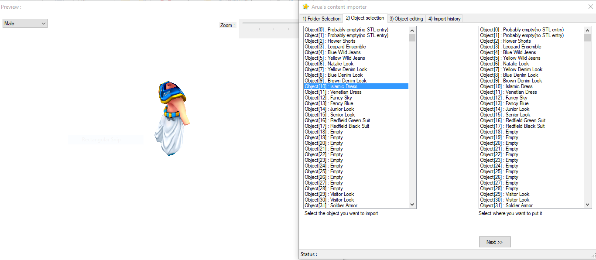

# ROSE-Content-Importer
Another project I recovered, slightly older: 2009. It was used at [AruaROSE](http://aruarose.com/) for importing content into our game client.
It uses XNA 3.0 and .NET 3.5.

I managed to get back the sources but it wouldn't most likely compile again in this current state!
You can use it for education purpose, though.

Jiwan
